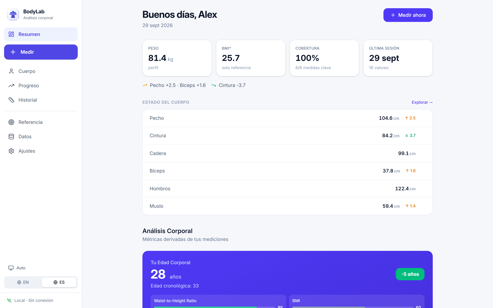
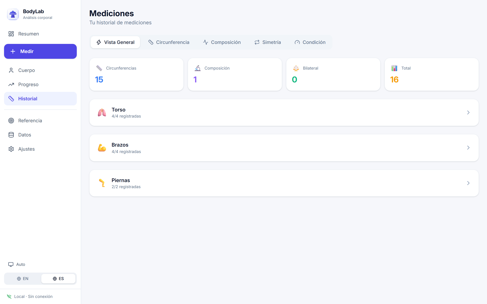
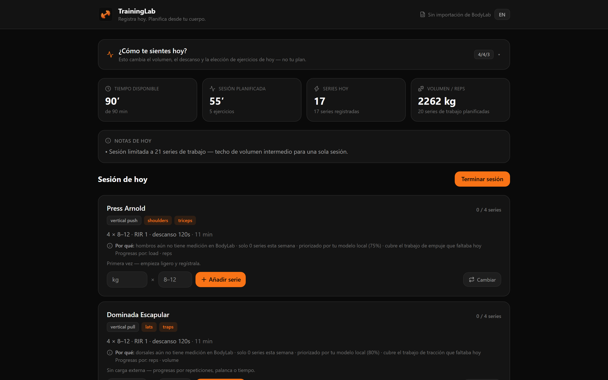
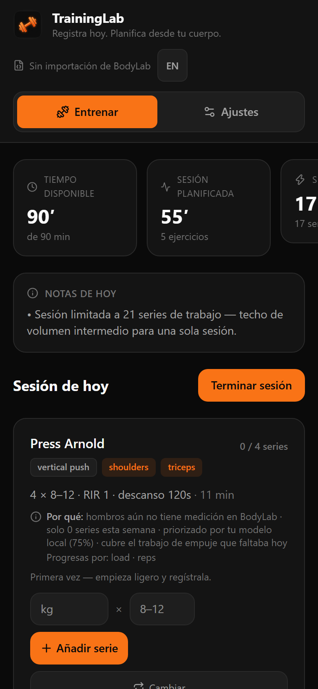

# Fitness — BodyLab + TrainingLab

> Dos aplicaciones locales, sin cuenta y sin servidores, para **medir tu cuerpo** y **entrenar con un plan que se deriva de esas medidas**.
>
> *Two local, account-free apps: measure your body (BodyLab) and train from a plan derived from those measurements (TrainingLab). Offline-first, data stays on your device.*

[](https://github.com/SCP-00/Fitness/releases)
[](fitness-ecosystem/docs/TESTING.md)
[](fitness-ecosystem/LICENSE)
[](#-descargar)

---

## ⬇️ Descargar

Windows 10/11 · instalador NSIS · ~4–18 MB · sin dependencias, sin cuenta, funciona sin internet.

| Aplicación | Descarga directa | Qué es |
| --- | --- | --- |
| **BodyLab** | **[⬇ BodyLab-setup.exe](https://github.com/SCP-00/Fitness/releases/latest/download/BodyLab-setup.exe)** | Antropometría, análisis corporal, modelo 3D, educación de ejercicios |
| **TrainingLab** | **[⬇ TrainingLab-setup.exe](https://github.com/SCP-00/Fitness/releases/latest/download/TrainingLab-setup.exe)** | La sesión de hoy: tiempo, equipamiento, registro de series, descansos |

Los dos enlaces apuntan siempre a la **última versión publicada**: no hay que buscar el archivo con el número de versión en su nombre. Historial completo en [Releases](https://github.com/SCP-00/Fitness/releases).

> **Aviso de Windows:** los instaladores no están firmados con un certificado de código (cuestan dinero y esto es un proyecto personal). Windows SmartScreen mostrará "Windows protegió tu PC" la primera vez: pulsa **Más información → Ejecutar de todas formas**. Si prefieres no instalar nada, usa la versión web de abajo.

### 🌐 Probar en el navegador (sin instalar)

| | |
| --- | --- |
| **BodyLab** | <https://scp-00.github.io/Fitness/bodylab/> |
| **TrainingLab** | <https://scp-00.github.io/Fitness/traininglab/> |

Funcionan igual que el escritorio: todo ocurre en tu navegador y tus datos viven en su IndexedDB local. Nada sale de tu dispositivo.

---

## 📸 Cómo se ve

| BodyLab — Resumen | BodyLab — Historial |
| --- | --- |
|  |  |

| TrainingLab — Sesión de hoy | Móvil (misma app, misma URL) |
| --- | --- |
|  |  |

*Las capturas se **generan** desde el bundle compilado (`node scripts/capture-screenshots.mjs`), no se toman a mano: si la app cambia, las capturas se vuelven a hacer con un comando en lugar de quedarse desactualizadas sin que nadie lo note.*

---

## 🧠 Qué hace cada mitad

### BodyLab — la mitad científica

- **Antropometría** con protocolos explicados: perímetros, pliegues cutáneos (Jackson-Pollock 3), cintas Navy, Cooper de 12 min, frecuencia cardíaca en reposo.
- **Análisis matemático** del estado corporal para hombres y mujeres: McCallum, Venus, Adonis, somatotipo, WHtR, índice de simetría, composición estimada con su error declarado (SEE).
- **Modelado 2D/3D** del cuerpo a partir de tus medidas, con mapas musculares y anatomía.
- **Educación**: mecánica del ejercicio, tipo de movimiento, qué músculo trabaja, cómo progresar cada ejercicio y qué medición lo mide.
- **Progreso**: evolución temporal, comparación de instantáneas, edad corporal, riesgo de salud y correlaciones.
- **Tu edad se deriva de tu fecha de nacimiento** cada vez que se muestra; nunca se guarda un número de edad que envejezca mal.

### TrainingLab — la mitad que se entrena

- **Pantalla "Hoy"**: una sesión planificada para el tiempo que tienes (por defecto 90 minutos, nunca se pasa).
- **Readiness**: energía, motivación y agujetas del día modulan la sesión.
- **Tu equipamiento real**: declaras lo que tienes (barra de dominadas, paralelas, mancuernas ajustables, bici…) y el planificador no propone nada que no puedas hacer.
- **Registro con teclado**: series, peso, repeticiones, RIR, cronómetro de descanso, notas.
- **Reconocimiento de récords**: Epley redondeado igual que en BodyLab, con aviso visual y sonido cuando superas un PR.
- **Cues de sonido sintetizados** (Web Audio, sin archivos): campana al terminar la sesión, logro al completar una prescripción, fanfarria al batir un récord.
- **IA local en tres niveles**: (1) reglas deterministas, (2) un pequeño modelo de decisión entrenado en tu propio historial que explica sus elecciones, (3) **opcional**: un LLM local en tu máquina (llama.cpp / LM Studio / Ollama / Jan) que propone y la aritmética dispone. Todo sigue estando en tu ordenador.

### El ecosistema: medir → entrenar → volver a medir

BodyLab exporta un archivo de enlace (`bodylab-traininglab-link`, contrato **v2**) con tu perfil, tus medidas, tus **puntos débiles** (puntuación por segmento) y tus récords personales. TrainingLab lo importa y planifica contra él: prioriza lo que no entrenas y lo que se queda atrás según tus medidas. Vuelves a medirte, exportas otra vez, y el plan se recalcula.

---

## 👨‍👩‍👧 Uso en familia por LAN (opcional)

Sin servidor no hay nada compartido: cada dispositivo tiene sus datos. Si quieres que tu familia y tú veáis el mismo historial en la red de casa, hay un **mini servidor local con SQLite**:

```bash
pnpm lan --shared          # sirve ambas apps para la LAN + historial compartido
```

- Guarda en un único archivo SQLite (`node:sqlite`, sin dependencias externas) los miembros, sesiones, series y registros de salud.
- **Login no estricto**: en la LAN basta con escribir tu nombre para reclamar tu historial; en la web y el escritorio **no hay login ninguno** porque la app es local.
- El historial compartido se sirve **en claro** dentro de tu red: queda escrito en la interfaz, porque no es privado. Úsalo sólo en una red de confianza.

---

## 🔒 Privacidad

- **Sin cuentas, sin telemetría, sin analítica, sin nube.** Nada del código envía datos a ningún sitio.
- Tus medidas y tus series viven en el IndexedDB de tu navegador o del webview del escritorio. Haz copia de seguridad con la exportación JSON/CSV.
- La única conexión de red posible es la que tú abras: tu servidor LAN o tu propio servidor LLM en `127.0.0.1`.
- La comprobación de actualizaciones del escritorio es **manual y opcional** (Ajustes), con Tauri updater. Nada se descarga solo.

---

## 🗺️ Estado

- **BodyLab**: `1.0.0-beta.5` — funcional y usable a diario; pulido de UI y accesibilidad en curso.
- **TrainingLab**: `0.1.0` — pantalla "Hoy" completa (plan, registro, descansos, récords, sonidos, notificaciones, historial compartido); el resto de la app (biblioteca, historial largo, ajustes avanzados) va detrás.
- Calidad: **775 tests** del núcleo + **110** de la web + E2E de navegador y humo del binario de escritorio. `pnpm check` corre la pirámide completa.

Detalle de lo hecho y lo que falta: [`ROADMAP.md`](ROADMAP.md) y [`fitness-ecosystem/CHANGELOG.md`](fitness-ecosystem/CHANGELOG.md).

---

<details>
<summary><strong>Para desarrolladores</strong> (arranque, arquitectura, convenciones)</summary>

### Arranque

```bash
pnpm install                     # Node >= 20, pnpm >= 11
pnpm dev                         # BodyLab web → http://localhost:5173
pnpm lan                         # ambas apps para la LAN + hub → http://localhost:8090
pnpm test                        # 775 tests del núcleo
pnpm check                       # typecheck + núcleo + web + E2E
```

Todo se ejecuta **desde `fitness-ecosystem/`**, que es el monorepo real:

```
fitness-ecosystem/
├── bodylab/
│   ├── core/            # motor puro en TypeScript, cero UI/DOM (antropometría,
│   │                    # composición, referencias, progreso, validación, export,
│   │                    # analytics, conditioning, training, exercises, database)
│   ├── integrations/    # oxihuman (3D WASM), musclemapjs, clad-body (ISO 8559-1)
│   ├── packages/contracts
│   └── apps/{web,desktop}
├── traininglab/apps/desktop   # app propia (Vite + React + Tauri 2)
├── scripts/                   # serve-lan, lan-store/lan-api (SQLite), iconos, capturas
├── tests/                     # suites del núcleo (se ejecutan desde la raíz)
└── docs/                      # arquitectura, estrategia, capturas
```

### Escritorio

```bash
cd bodylab/apps/desktop     && pnpm dev     # BodyLab en ventana nativa
cd traininglab/apps/desktop && pnpm dev     # TrainingLab en ventana nativa
```

Requiere Rust estable y Visual Studio Build Tools (C++), una sola vez. `pnpm build` genera el instalador NSIS.

### Convenciones que se cumplen en todo el repo

- El núcleo es TypeScript puro: **nunca** importa React, Three, Tauri ni el DOM.
- Los números escritos por el usuario pasan por `parseNumberInput` (coma decimal española incluida).
- Identificadores y comentarios en inglés; la interfaz en español e inglés.
- Los alias `@fitness/bodylab-*` se declaran en seis archivos a la vez (raíz, web y TrainingLab: Vite + Vitest + TypeScript); `database` es la única excepción sin alias.
- Los workflows viven en `.github/workflows/` **en la raíz del repositorio** (GitHub no lee los de subcarpetas).

Los detalles están en [`AGENTS.md`](AGENTS.md) y en [`fitness-ecosystem/docs/ARCHITECTURE.md`](fitness-ecosystem/docs/ARCHITECTURE.md).

</details>

---

## 📜 Licencia y créditos

- Código: **Apache-2.0** — [`fitness-ecosystem/LICENSE`](fitness-ecosystem/LICENSE).
- Contenido anatómico derivado de **Z-Anatomy**, bajo **CC BY-SA 4.0**: si redistribuyes esos assets, mantén la misma licencia y la atribución.
- Librerías de terceros y sus licencias: [`THIRD_PARTY_NOTICES.md`](fitness-ecosystem/THIRD_PARTY_NOTICES.md).
- Iconos de marca, sonidos y capturas: propios de este proyecto.

Hecho por [SCP-00](https://github.com/SCP-00) con la ayuda de Freebuff.
