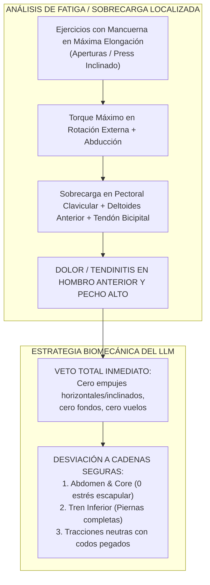
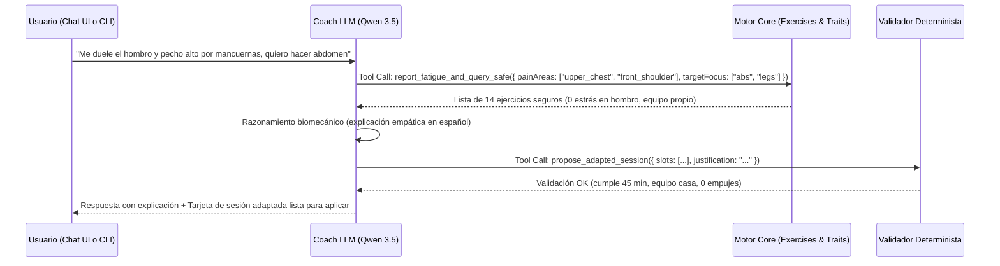

# Plan de Ejecución: Coach LLM Local (Qwen 3.5 - 4B + llama.cpp) en TrainingLab

> **Documento de Diseño Técnico y Arquitectura de Inteligencia Artificial Local**  
> **Motor:** `llama.cpp` (loopback `127.0.0.1:8080`) con modelo cuantizado `Qwen3.5-4B-Q4_K_M.gguf`  
> **Filosofía de Arquitectura:** *El LLM propone; la biomecánica, las reglas duras deterministas y el usuario disponen.*  
> **Objetivo:** Transformar el asistente en un coach biomecánico empático y riguroso capaz de resolver fatiga, dolores musculares y adaptaciones en tiempo real mediante Chat UI, Tool Calling tipado y una interfaz CLI de alto rendimiento.

---

## 1. El Caso de Uso Biomecánico: Anatomía, Fatiga y Adaptación

### 1.1. Diagnóstico del Escenario Real del Usuario
> *"En este momento me duelen los músculos que conectan el pecho superior y el hombro bajo por ejercicios de mancuerna, pero quiero entrenar mi abdomen y otros músculos aún no entrenados."*

#### Análisis Anatómico y Fisiológico de la Lesión/Fatiga:
1. **Estructuras Anatómicas Involucradas:**
   * **Porción Clavicular del Pectoral Mayor:** Se origina en la cara anterior de la mitad medial de la clavícula y se inserta en el labio lateral del surco intertubercular del húmero.
   * **Deltoides Anterior:** Comparte inserción y vector de tracción con el pectoral superior en la flexión y aducción horizontal del brazo.
   * **Tendón de la Porción Larga del Bíceps Braquial:** Discurre por la corredera bicipital, justo debajo del pectoral superior y deltoides anterior.
   * **Manguito Rotador (Supraespinoso y Subescapular):** Estabilizadores dinámicos de la cabeza humeral en el espacio subacromial.

2. **Mecanismo de Sobrecarga con Mancuernas:**
   * En ejercicios como aperturas con mancuernas (*dumbbell flyes*) o press inclinado pesado con mancuernas, la mayor demanda de torque sobre la articulación glenohumeral se produce en la **máxima elongación excéntrica** (al final de la fase descendente, cuando los codos están abiertos).
   * Esto somete la unión miotendinosa del pectoral superior y la cápsula anterior del hombro a fuerzas de cizallamiento extremas, generando microrroturas tendinosas y compresión en la corredera bicipital.



3. **Prescripción de Adaptación:**
   * **Grupos y Articulaciones Vetados Hoy:** Articulación glenohumeral (hombro) bajo flexión/abducción; pectoral mayor (todas las porciones), deltoides anterior.
   * **Grupos Habilitados y Frescos:**
     * **Core / Abdomen:** Elevaciones de piernas colgado (*hanging leg raises*), crunches en polea alta con agarre neutro pegado al mentón, plancha frontal isométrica (*plank*), rueda abdominal (*ab wheel* si no duele el hombro).
     * **Tren Inferior:** Sentadilla (*squat*), prensa de piernas (*leg press*), extensiones de cuádriceps, curl femoral en máquina, gemelos.
     * **Espalda (Opcional):** Remo sentado con agarre neutro estrecho (*seated cable row close grip*) manteniendo los codos pegados al costado (menor a 30° de abducción), evitando estirar el brazo hacia adelante.

---

## 2. Arquitectura del Motor LLM: Qwen 3.5 - 4B + llama.cpp

### 2.1. Configuración de Ejecución de Alto Rendimiento
El modelo disponible es `C:\Users\andyh\Downloads\Qwen3.5-4B\Qwen3.5-4B-Q4_K_M.gguf` (3.3 GB).  
Para garantizar que las llamadas a herramientas y el chat respondan en **menos de 800 ms** en local, `llama.cpp` se configurará con:

```powershell
llama-server `
  -m "C:\Users\andyh\Downloads\Qwen3.5-4B\Qwen3.5-4B-Q4_K_M.gguf" `
  --alias "traininglab-coach" `
  --port 8080 `
  --host 127.0.0.1 `
  --jinja `
  -c 8192 `
  -ngl 99 `
  -fa `
  --threads 8 `
  --temp 0.3 `
  --top-p 0.8
```

* **`--jinja`:** Activa el motor de plantillas de chat nativo de Qwen con soporte para **gramáticas GBNF automáticas**. Esto obliga al modelo a generar JSON válido cuando llama a herramientas, evitando alucinaciones o sintaxis rota.
* **`-fa` (Flash Attention):** Reduce el consumo de VRAM a la mitad y acelera la inferencia en secuencias largas con historial de entrenamiento.
* **`-ngl 99`:** Descarga todas las capas posibles a la GPU (CUDA/Vulkan). En una GPU de 6 GB a 8 GB VRAM, un modelo 4B Q4_K_M corre al 100% en memoria de video a velocidades de >60 tokens/segundo.
* **`--temp 0.3`:** Temperatura baja para que el razonamiento sea clínico y determinista, evitando que invente ejercicios inexistentes.

---

## 3. Tool Calling Biomecánico Especializado

El módulo actual [llm.ts](file:///c:/Users/andyh/Projects/FreeBody/fitness-ecosystem/traininglab/apps/desktop/src/lib/llm.ts) solo tiene 5 herramientas genéricas que no permiten filtrar por articulación con dolor ni por músculo específico.  
Se añadirá una nueva suite de herramientas tipadas orientada a **fatiga y adaptación biomecánica**:



### 3.1. Definición de Herramientas JSON Schema para Qwen

#### Herramienta 1: `report_fatigue_and_query_safe`
Permite al modelo declarar las zonas con molestias y obtener de inmediato ejercicios biomecánicamente seguros:

```json
{
  "name": "report_fatigue_and_query_safe",
  "description": "Declara dolor o fatiga en articulaciones/músculos y obtiene una lista de ejercicios seguros y compatibles con el equipamiento del usuario que evitan totalmente esas zonas.",
  "parameters": {
    "type": "object",
    "properties": {
      "painOrFatigueAreas": {
        "type": "array",
        "items": { "type": "string" },
        "description": "Zonas con dolor o fatiga: 'upper_chest', 'front_shoulder', 'rotator_cuff', 'lower_back', 'knees', 'elbows'."
      },
      "targetFocus": {
        "type": "array",
        "items": { "type": "string" },
        "description": "Músculos que sí se desean entrenar: 'abs', 'obliques', 'quads', 'hamstrings', 'calves', 'lats'."
      }
    },
    "required": ["painOrFatigueAreas"]
  }
}
```

#### Herramienta 2: `propose_adapted_session` (Terminal Tool)
Permite al modelo presentar la nueva sesión prescrita con explicación clínica:

```json
{
  "name": "propose_adapted_session",
  "description": "HERRAMIENTA FINAL. Propone la sesión modificada para hoy, justificando por qué cada ejercicio es seguro y cómo se estructuran las series y el descanso.",
  "parameters": {
    "type": "object",
    "properties": {
      "clinicalReasoning": {
        "type": "string",
        "description": "Explicación breve en español sobre por qué se retiraron los ejercicios lesivos y por qué los nuevos protegen la articulación."
      },
      "slots": {
        "type": "array",
        "items": {
          "type": "object",
          "properties": {
            "exerciseId": { "type": "string" },
            "sets": { "type": "integer" },
            "repsMin": { "type": "integer" },
            "repsMax": { "type": "integer" },
            "restSec": { "type": "integer" },
            "cue": { "type": "string", "description": "Indicación técnica de seguridad." }
          },
          "required": ["exerciseId", "sets", "repsMin", "repsMax", "restSec"]
        }
      }
    },
    "required": ["clinicalReasoning", "slots"]
  }
}
```

---

## 4. Conexión de Tipo CLI (`fitness-coach-cli.mjs`)

Para facilitar que el LLM se conecte con la aplicación de forma optimizada, programática y desde herramientas externas, crearemos un CLI autónomo en `scripts/fitness-coach-cli.mjs`.

### 4.1. Capacidades del CLI:
1. **Modo Evaluación / Diagnóstico:**
   ```bash
   node scripts/fitness-coach-cli.mjs --diagnose "dolor en pecho superior y hombro por mancuernas" --focus "abdomen"
   ```
2. **Modo Chat Interactivo en Terminal (REPL):**
   ```bash
   node scripts/fitness-coach-cli.mjs --interactive
   ```
3. **Modo Pipe / Subagente JSON:**
   Permite recibir un JSON de entrada por `stdin` y responder con la propuesta validada por `stdout`:
   ```bash
   echo '{"soreness":["upper_chest","shoulder"],"target":["abs"]}' | node scripts/fitness-coach-cli.mjs --pipe
   ```

### 4.2. Estructura de Implementación del CLI:
```ts
// scripts/fitness-coach-cli.mjs
import { chatWithTools, buildSystemPrompt } from '../traininglab/apps/desktop/src/lib/llm.ts';
import { ALL_EXERCISES, EXERCISE_TRAITS } from '@fitness/bodylab-exercises';
import { parseArgs } from 'node:util';

// 1. Carga contexto local de IndexedDB o argumentos
// 2. Mapea la sintaxis clínica de dolor a EXERCISE_TRAITS.jointStress
// 3. Conecta con http://127.0.0.1:8080/v1
// 4. Valida la salida con validateProposal determinista
// 5. Muestra el resultado formateado con colores ANSI en terminal o JSON puro
```

---

## 5. Base de Conocimiento de Fitness (Fitness Knowledge Base)

La base de conocimiento integrada en el prompt del sistema y en `knowledge.json` se enriquecerá con las siguientes **reglas médicas y biomecánicas**:

### 5.1. Matriz de Exclusión de Estrés Articular
| Síntoma / Dolor Reportado | Ejercicios Contraindicados | Ejercicios Sustitutos de Máxima Seguridad |
|---|---|---|
| **Pectoral superior / Hombro anterior** (Dolor en unión esternoclavicular o bicipital) | Press banca inclinado, aperturas mancuerna, flexiones profundas, fondos en paralelas. | **Abdomen:** Hanging leg raise, crunch en polea con codos pegados.<br/>**Tren Inferior:** Sentadilla, prensa, curl femoral.<br/>**Espalda:** Remo polea baja agarre neutro cerrado. |
| **Dolor Lumbar / Hernia discal** (Molestia al flexionar o cargar la columna axialmente) | Peso muerto convencional, sentadilla con barra trasera, remo con barra 90°, buenos días. | Sentadilla búlgara con mancuernas al costado, prensa de piernas a 45°, hiperextensiones a 45° con columna neutra, plancha abdominal. |
| **Tendinitis Rotuliana (Rodilla)** (Dolor en polo inferior de rótula al descender) | Extensión de cuádriceps pesada con rebote, sentadilla sissy, zancadas hacia adelante. | Peso muerto rumano, curl femoral acostado, puente de glúteos, sentadilla goblet con espinillas verticales. |
| **Epicondilitis / Codo de tenista** | Extensiones tríceps en polea con agarre prono forzado, press francés con barra recta. | Tríceps con cuerda manteniendo muñeca neutra, flexiones diamante en banco inclinado, remos con empuñaduras giratorias. |

---

## 6. Experiencia de Usuario In-App (Chat / Coach Drawer)

### 6.1. Diseño de la Interfaz en TrainingLab
El chat del coach se ubicará como un **panel deslizante (Drawer) accesible desde dos lugares estratégicos**:
1. **En Inicio:** Tarjeta *"¿Cómo te sientes hoy?"* junto al selector de readiness.
2. **En Entrenamiento (ZEN):** Botón flotante accesible con el pulgar: `💬 Coach IA`.

```
┌────────────────────────────────────────────────────────┐
│ TRAININGLAB — COACH IA LOCAL (DRAWER SLIDE-OVER)        │
├────────────────────────────────────────────────────────┤
│ 🤖 Coach Local (Qwen 3.5 - 4B)               [✕ Cerrar]│
│ Modo 100% offline · 0 telemetría                       │
├────────────────────────────────────────────────────────┤
│ 👤 Usuario:                                            │
│ "Me duelen los músculos entre el pecho alto y el       │
│  hombro por las mancuernas. Quiero hacer abdomen."     │
├────────────────────────────────────────────────────────┤
│ 🤖 Coach IA:                                           │
│ "Entendido. Tienes sobrecarga en el pectoral           │
│  clavicular y el tendón bicipital anterior por torque  │
│  excéntrico con mancuernas.                            │
│                                                        │
│  He retirado todos los empujes y fondos de hoy. En su  │
│  lugar, adaptaremos la sesión a Core y Tren Inferior:  │
│                                                        │
│  1. Elevaciones de piernas colgado — 4 series × 12 reps│
│  2. Crunch en polea alta (codos neutros) — 3 × 15 reps │
│  3. Plancha isométrica sobre antebrazos — 3 × 45s      │
│  4. Prensa de piernas (opcional) — 3 × 10 reps         │
│                                                        │
│  Tiempo estimado: 40 min · Estrés en hombro: 0%"       │
├────────────────────────────────────────────────────────┤
│ [ ✅ Aplicar esta sesión a hoy ]   [ 🔄 Ajustar otra cosa ]│
└────────────────────────────────────────────────────────┘
```

### 6.2. Integración con el Store de TrainingLab
Al hacer clic en `[ Aplicar esta sesión a hoy ]`:
1. El store ejecuta la acción `APPLY_COACH_SESSION`.
2. Las filas `todayRows` de la sesión activa se actualizan en memoria e IndexedDB.
3. Se muestra un banner de confirmación: *"Sesión adaptada por el Coach IA — Hombro protegido"*.
4. Si el usuario se arrepiente, tiene disponible el botón **Deshacer** durante 8 segundos.

---

## 7. Plan de Verificación y Pruebas Automatizadas

1. **Pruebas de Integración Wire (`tests/training/test_llm_coach_qwen.test.ts`):**
   * Simulación del caso de dolor en pecho superior / hombro con `fakeFetch`.
   * Verificación de que el tool calling invoca `report_fatigue_and_query_safe` con los argumentos exactos.
   * Verificación de que la propuesta final es validada por `validateProposal` sin errores.
2. **Prueba CLI Headless:**
   * Ejecutar el script CLI contra un mock server de loopback y comprobar salida JSON limpia.
3. **Prueba End-to-End en Navegador (`scripts/audit-app-behavior.mjs`):**
   * Abrir el Coach Drawer en TrainingLab.
   * Seleccionar el chip rápido *"Molestia en Hombro"*.
   * Verificar que la sesión de entrenamiento se adapte en pantalla sin recargar la página.
