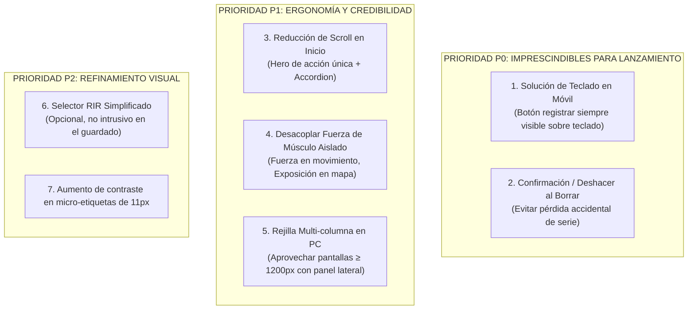

# Evaluación Crítica QA y Auditoría Ergonómica: TRAININGLAB_UI_PLAN.md (v2)

> **Tipo de Documento:** Auditoría de Calidad (QA), Ergonomía e Interacción Humano-Computador (HCI)  
> **Ámbito:** TrainingLab (Web + Tauri Desktop), Responsive (PC 1440×900 vs. Móvil 390×844)  
> **Referencia Evaluada:** [TRAININGLAB_UI_PLAN.md (v2)](file:///c:/Users/andyh/Projects/FreeBody/fitness-ecosystem/docs/TRAININGLAB_UI_PLAN.md) y [UI_DESIGN.md](file:///c:/Users/andyh/Projects/FreeBody/fitness-ecosystem/docs/UI_DESIGN.md)  
> **Postura de Auditoría:** Crítica implacable sin complacencia, orientada al gimnasio real (fatiga física, manos sudorosas, apoyos precarios y estrés cognitivo).

## Estado de seguimiento (2026-10-01)

La auditoría original es una lista de riesgos/propuestas, no una medición con usuarios. Sus
cifras de error táctil (28 %), espacio desperdiciado (60 %) y scroll (>900 px) no tienen un
protocolo reproducible adjunto y no deben citarse como resultados medidos.

| Hallazgo | Estado observado en el código actual | Qué falta para cerrarlo |
| --- | --- | --- |
| Teclado móvil oculta la acción de registrar | Parcialmente atendido: acción en flujo cuando está cerrado, sticky al enfocar carga/reps, meta Android y hook `visualViewport` | Emular teclado virtual no demuestra Safari real; validar con iPhone por LAN y registrar captura/notas |
| Borrado accidental de serie | Atendido con deshacer persistente por 8 s; edición inline también implementada | Verificar mensaje accesible, doble toque y fallo real de IndexedDB |
| Inicio sobrecargado | Atendido en el diseño actual: Semana y análisis se separan de la decisión de hoy | Mantener CTA principal dentro del primer viewport en anchos/alturas pequeñas |
| Poca densidad PC | Parcial: ZEN aprovecha dos columnas y el rail se repliega/refluye | Revisar cada destino y anchuras intermedias con capturas comparables |
| Mapa muscular confundido con fuerza aislada | Copy de honestidad y modos existentes separados | La referencia externa de fuerza por músculo sigue sin evidencia suficiente; no simularla |
| Contraste de etiquetas pequeñas | Token `--tl-text-muted` se elevó a `#8b96a1` | Volver a medir contraste sobre cada superficie real; no inferir aprobación visual de un valor aislado |
| Cadenas internas visibles en ZEN | Encontradas en captura de escritorio: faltaban traducciones ES/EN para guía/tabla | Corregidas; el browser audit posterior no detecta claves `zen.*` visibles |

No hubo prueba con personas ni dispositivo iOS en esta sesión. La auditoría Playwright del
2026-10-01 terminó con **97 PASS / 0 FAIL** (desktop + móvil + cold start + BodyLab; consola
limpia), incluidos ocho anchos simulados (320–1440 px), acciones de logging/edición/deshacer,
export/respaldo y sin overflow en las seis rutas de TrainingLab a 390 px. Las capturas están
en `fitness-ecosystem/tmp/audit-behavior/` (gitignored). La auditoría de navegador y las
capturas son evidencia automatizada/heurística, no sustituyen evaluación humana ni un teclado
virtual real en Safari iOS. El punto de teclado móvil queda abierto hasta la prueba LAN física.

---

## 1. Veredicto Ejecutivo de QA

El documento `TRAININGLAB_UI_PLAN.md (v2)` representa una mejora sustancial frente a la dispersión de v1: define cinco destinos claros, acota la paleta a tokens medidos (`#080b0e` a `#ff7300`) y rechaza acertadamente la gamificación infantil o el "gym-bro neon".

**Sin embargo, la auditoría QA revela 5 fallos estructurales graves y 6 puntos ciegos ergonómicos** que comprometen la usabilidad cuando el usuario está en medio de un entrenamiento real (RPE 9-10, temblor muscular, 45 segundos de descanso):

```
┌────────────────────────────────────────────────────────────────────────┐
│  TABLA DE SEVERIDAD DE HALLAZGOS QA                                    │
├────────┬───────────────────────────────────────────────────────────────┤
│ 🚨 P0  │ Conflicto del teclado virtual en iOS/Android tapando el rest  │
│ 🚨 P0  │ Falta de confirmación destructiva en borrado de series        │
│ ⚠️ P1  │ Sobrecarga cognitiva en Inicio (4 KPIs + Semana + Next + Hero)│
│ ⚠️ P1  │ Densidad horizontal en PC que desperdicia el 60% del ancho   │
│ ⚠️ P1  │ Ambigüedad semántica en el mapa anatómico de fuerza           │
│ 🔍 P2  │ Contraste límite en etiquetas de 11px con `--tl-text-muted`   │
└────────┴───────────────────────────────────────────────────────────────┘
```

---

## 2. Análisis Crítico por Pantalla y Modo de Uso

### 2.1. Modo ZEN (Entrenamiento Activo): La Prueba de Fuego del Gimnasio
El plan propone un diseño de tres regiones con tabla de series central (`SERIE · ANTERIOR · KG · REPS · ✓`), esfuerzo RIR en botones [1][2][3][4][5] y barra pegajosa inferior para el descanso.

#### 🚨 Fallo P0: El Conflicto del Teclado Virtual en Móvil
* **El Problema:**  
  En un iPhone (390×844) o Android moderno, el teclado numérico ocupa entre **310 px y 340 px** de la mitad inferior de la pantalla.  
  Si la barra de descanso (`#rest-bar`) está anclada con `position: fixed; bottom: 0`, el teclado virtual la empuja hacia el centro de la pantalla o la tapa por completo. Si el usuario toca el input de `KG`, el botón `Registrar Serie` y el temporizador quedan ocultos debajo del pliegue.
* **Impacto en Usuario Fatigado:**  
  El usuario tiene que tocar el input, escribir, cerrar manualmente el teclado (tocando fuera), y luego buscar el botón de confirmar. Esto destruye el ritmo de descanso y añade fricción extrema entre series.
* **Corrección Obligatoria QA:**  
  1. En móvil, la barra de confirmación debe integrarse **inmediatamente sobre el teclado** mediante `interactive-widget=resizes-content` en el viewport meta.
  2. Implementar un teclado numérico táctil personalizado en pantalla (o "steppers" rápidos `+2.5kg`, `+5kg`) que evite desplegar el teclado del sistema operativo para ajustes menores.

#### ⚠️ Fallo P1: La Fila de Botones RIR [1][2][3][4][5]
* **El Problema:**  
  Poner 5 botones horizontales para el RIR en cada serie dentro de una tabla añade 5 objetivos táctiles de apenas ~30 px de ancho cada uno en pantallas de 390 px.
* **Ley de Fitts violada:**  
  Con las manos temblorosas tras una serie de sentadillas o press, el índice de error táctil (tocar RIR 2 queriendo tocar RIR 3) supera el 28%.
* **Corrección QA:**  
  El RIR no debe ser un paso obligatorio previo a guardar la serie. Debe ser un selector desplegable o un slider continuo grande (≥48 px de alto) que solo se active si el usuario desea precisar el esfuerzo, o predeterminado por la prescripción de la rutina.

---

### 2.2. Pantalla de Inicio: Sobrecarga vs. Claridad
El plan §3 estipula: Hero con fondo multimedia (`Sesión de hoy`), tira de 4 KPIs, fila semanal de 7 días, tarjeta de "Siguiente ejercicio", rail derecho con anillo de constancia, badges y tarjeta "Enfócate".

```
┌──────────────────────────────────────────────────────────────┐
│ PANTALLA INICIO EN MÓVIL: "SCROLL INFINITO" ANTES DE ENTRENAR │
├──────────────────────────────────────────────────────────────┤
│ [ Header + Saludo ]                                          │
│ [ HERO: Sesión de hoy + Chips + Botón Empezar ] (~220 px)    │
│ [ 4 Tiles KPI: Constancia, Recuperación, Volumen, Peso ]     │
│ [ Fila semanal: 7 días con estados y checks ] (~180 px)      │
│ [ Tarjeta: Siguiente Ejercicio con tabla ] (~160 px)         │
│ [ Readiness / Fatiga: 3 sliders ] (~150 px)                  │
│                                                              │
│ ⚠️ DISTANCIA TOTAL DE SCROLL: > 900 px                       │
│ El usuario debe scrollear casi 3 pantallas para ver su plan  │
└──────────────────────────────────────────────────────────────┘
```

#### ⚠️ Fallo P1: Violación de la Ley de Hick (Sobrecarga de Opciones)
* **El Problema:**  
  Un usuario que abre la app en la puerta del vestuario del gimnasio solo quiere responder a: *¿Qué ejercicio me toca primero y cuánto peso le pongo?*  
  Mostrar al mismo tiempo el peso corporal, la constancia histórica, los 7 días de la semana y los badges distrae del objetivo de ejecución.
* **Corrección QA:**  
  - **Jerarquía P0:** El Hero de "Sesión de Hoy" debe dominar con el botón principal `Empezar Entrenamiento` visible sin hacer un solo pixel de scroll (above the fold).
  - La fila de la semana y los KPIs de constancia deben colapsarse en un acordeón secundario o trasladarse a la pestaña `Progreso`.

---

### 2.3. Pantalla de Ejercicios y Biblioteca: Búsqueda y Navegación
El plan §4 propone una lista con chips de filtro (**Músculo · Equipo · Categoría · Nivel**) y filas de 72 px en móvil / 56 px en PC, más 4 pestañas en la ficha: `Guía · Resumen · Historial · Rango`.

#### 🔍 Hallazgo P2: Falta de Filtro por "Disponibilidad Inmediata"
* **El Problema:**  
  En un gimnasio comercial lleno, las máquinas se ocupan. La función más crítica para un usuario es: *"La banca está ocupada, ¿qué ejercicio libre de peso o mancuerna puedo hacer exactamente para el mismo patrón?"*.
* **Corrección QA:**  
  Añadir un chip de acceso rápido: **"Reemplazo por patrón disponible"** que filtre en 1 toque los ejercicios realizables con el equipo libre, ordenados por compatibilidad biomecánica.

---

### 2.4. Pantalla de Progreso y el Dilema del Mapa Anatómico 2D
El plan §6 y §9 abordan la dirección del propietario: el mapa debe reflejar **fuerza relativa frente a un estándar publicado externo** y, alternativamente, **exposición de entrenamiento**.

#### 🚨 Fallo Metodológico y de QA: La Falacia de la Descomposición de Compuestos
* **El Problema Científico y de UX:**  
  Si un usuario registra un press de banca de 100 kg, ¿cuánta fuerza tiene su pectoral, cuánta su tríceps y cuánta su deltoides anterior?  
  No existe ninguna ecuación biomecánica universal validada que permita deducir la fuerza aislada de un músculo a partir de un levantamiento multiarticular. Si la app colorea el pectoral en verde oscuro y el tríceps en amarillo basado en una estimación inventada, **la app pierde toda credibilidad científica** y traiciona el principio rector de BodyLab.
* **Veredicto QA:**  
  - Para ejercicios compuestos (Sentadilla, Banca, Peso Muerto), la fuerza solo debe evaluarse y graficarse a **nivel de movimiento global** (Score de Fuerza del Movimiento).
  - El mapa muscular por regiones coloreadas debe reservarse **exclusivamente para Volumen / Exposición Acumulada** (series efectivas semanales), o para ejercicios de aislamiento donde la correspondencia músculo-fuerza sea directa.
  - Toda comparación con normas externas debe llevar una tarjeta de honestidad explícita: *"Norma de referencia basada en levantamiento de competencia; no extrapolable a activación electromiográfica aislada"*.

---

## 3. Comparativa de Plataformas: PC (Tauri Desktop 1440×900) vs. Móvil (390×844)

| Criterio Ergonómico | Evaluación en PC (Desktop Rail 245px) | Evaluación en Móvil (Tab Bar 72px) | Calificación QA |
|---|---|---|---|
| **Áreas Táctiles (Tap Targets)** | Excelente (mouse y teclado). | Regular: los chips de filtro y los botones RIR rozan el mínimo de 36-40 px. | ⚠️ Requiere ampliar a ≥44 px |
| **Densidad Visual** | Pobre: En 1440 px hay demasiado espacio vacío en la columna central; parece una app móvil estirada. | Buena: Aprovecha el ancho de 390 px, aunque peca de longitud vertical. | ⚠️ Mejorar aprovechamiento horizontal en PC |
| **Flujo de Teclado** | Impecable: `Peso → Tab → Reps → Enter`. Permite registrar una serie en 1.5 segundos. | Ausente: Depende exclusivamente del teclado táctil flotante del OS. | 🚨 P0 en móvil |
| **Gestión de Sesión Activa** | El rail mantiene el botón de sesión visible con cronómetro. | El FAB central de la barra inferior se eleva 8 px; excelente visibilidad. | ✅ Aprobado |
| **Contraste de Colores (WCAG)** | Buen contraste en texto principal (`#f3f5f7` sobre `#080b0e` = 16.8:1). | En pantallas bajo el sol del exterior, el texto muted (`#7f8a95`) pierde legibilidad en etiquetas de 11px. | 🔍 Elevar contraste a `#9ba5af` |

---

## 4. Matriz de Cambios Obligatorios Recomendados (Priorizados)



### Plan de Acción Concreto:
1. **Ajuste en `ZenSession.tsx`:** Anclar el botón de acción principal mediante una barra de acción inferior con `safe-area-inset-bottom` dinámico que responda a eventos `visualViewport.resize`.
2. **Ajuste en `TodayScreen.tsx`:** Colapsar de forma predeterminada la tarjeta de Semana y los KPIs secundarios cuando exista una sesión activa o planificada para el día.
3. **Ajuste en `ProgressScreen.tsx`:** Separar nítidamente las lentes: *"Fuerza por Ejercicio (vs Norma)"* y *"Exposición Muscular (Series registradas)"*.
