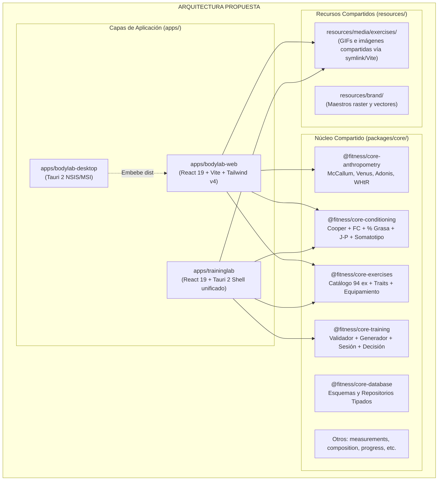
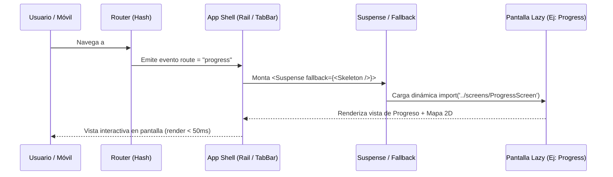
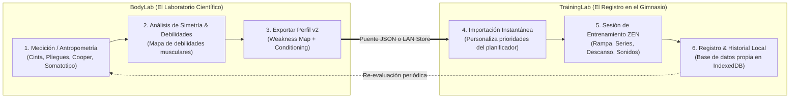

# Plan Maestro de Optimización y Reestructuración Integral: Fitness Ecosystem

> **Documento de Diseño Técnico y Arquitectura**  
> **Estado:** Propuesta exhaustiva en espera de revisión y aprobación del propietario.  
> **Fecha:** 2026-09-30  
> **Ámbito:** BodyLab (Web + Desktop Tauri), TrainingLab (Web + Desktop Tauri), Paquetes Core compartidos, Scripts y Estructura Monorepo.

---

## 1. Resumen Ejecutivo y Diagnóstico Global

El **Fitness Ecosystem** consta de dos aplicaciones con principios complementarios:
1. **BodyLab:** La mitad científica y analítica (antropometría, somatotipo, modelado 2D/3D, guías de medición y educación).
2. **TrainingLab:** La mitad ejecutiva y de registro (sesión rápida con presupuesto de tiempo, registro teclado-primero, modelo de decisión local, descansos y mapas de progreso).

Tras una auditoría minuciosa de la base de código, la configuración del monorepo, los árboles de compilación y los recursos estáticos, se han identificado **graves ineficiencias estructurales, de peso y de organización** fruto del crecimiento acelerado en fases F1 y F2:

| Parámetro | Estado Actual (Antes) | Estado Objetivo (Después) | Impacto / Ganancia |
|---|---|---|---|
| **Espacio en Disco Local** | **~6.5 GB** (5.6 GB de Rust `target/`, 375 MB de zips/anatomía duplicados) | **~1.8 GB - 2.2 GB** | **-65% de almacenamiento** (~4.3 GB liberados) |
| **Medios de Ejercicios** | **21.5 MB** (10.75 MB duplicados byte a byte en ambas apps) | **10.75 MB** (fuente única compartida) | **-50% de duplicación estática** |
| **Bundle Inicial TrainingLab** | **617.4 KB** en un solo archivo JS monolítico (sin code-splitting) | **~130 KB** (chunk inicial) + chunks lazy bajo demanda | **-78% de JavaScript bloqueante inicial** |
| **Micro-chunks en BodyLab** | **36 chunks JS** (más de 15 micro-archivos de iconos <300 bytes) | **5-6 chunks semánticos consolidados** | **Elimina cascada HTTP/2** y micro-latencias |
| **Estructura del Monorepo** | Motores compartidos (`training`, `exercises`, `conditioning`) dentro de `bodylab/core/`; 7 paquetes zombie vacíos en `traininglab/` | Arquitectura `apps/` y `packages/core/` desacoplada y simétrica | **Arquitectura modular limpia y escalable** |
| **Nombres en `package.json`** | Asimétricos: `"web"`, `"@fitness/bodylab-desktop"`, `"traininglab-desktop"` | Canónicos: `@fitness/bodylab-web`, `@fitness/bodylab-desktop`, `@fitness/traininglab` | **Consistencia y predictibilidad en pnpm** |
| **Flujo de Rutas** | TrainingLab importa 100% estático en App; BodyLab usa React Router v7 con chunks desordenados | Ambas apps con HashRouter optimizado, lazy loading por destino y Suspense | **Navegación instantánea en móvil y PC** |
| **Respaldo TrainingLab** | Sin exportación/backup propio (solo importa JSON de BodyLab) — *WARN* | Sistema nativo de backup JSON/ZIP bidireccional | **0% riesgo de pérdida de datos** (cierra el último WARN) |



---

## 2. Eje 1: Optimización de Tamaño (Bundle, Assets, Dependencias y Disco)

### 2.1. Deduplicación de Medios de Ejercicios (GIFs e Imágenes)
* **¿Por qué?**
  Actualmente, `bodylab/apps/web/public/exercises/` pesa **10.75 MB** y `traininglab/apps/desktop/public/exercises/` pesa exactamente **10.75 MB**. Son exactamente los mismos GIFs cinemáticos y fotografías de demostración copiados en dos carpetas dentro del repositorio Git. Esto desperdicia ancho de banda en descargas, ensucia los diffs y exige duplicar cualquier añadido o corrección de catálogo.
* **¿Para qué?**
  Tener una **única fuente de verdad** para los medios de los 94 ejercicios. Si se optimiza un GIF, se añade un ángulo o se corrige una imagen, ambas aplicaciones se actualizan inmediatamente sin duplicar archivos.
* **¿Cómo?**
  1. Centralizar los activos en `resources/media/exercises/`.
  2. En tiempo de desarrollo y compilación, vincularlos mediante un script de sincronización o symlink directory seguro en Windows (`mklink /D` o copia automática durante `pnpm build` / `pnpm dev` mediante plugin de Vite):
  ```ts
  // vite.config.ts (plugin de assets compartidos)
  import path from 'path';
  import { viteStaticCopy } from 'vite-plugin-static-copy';

  export function sharedExerciseMediaPlugin() {
    return viteStaticCopy({
      targets: [
        {
          src: path.resolve(__dirname, '../../../resources/media/exercises/*'),
          dest: 'exercises',
        },
      ],
    });
  }
  ```
* **¿Cuánto?**
  * **10.75 MB eliminados de forma inmediata del repositorio**.
  * Cero desincronización de medios entre ambas aplicaciones.

### 2.2. División de Código (Code-Splitting) en TrainingLab
* **¿Por qué?**
  Actualmente, el bundle de producción de TrainingLab genera un único archivo monolítico:
  `dist/assets/index-tbFvdSsM.js` con un tamaño de **617.41 KB**.
  Todas las pantallas (Inicio, Ejercicios con los 94 ejercicios en memoria, Detalle, Sesión de Entrenamiento ZEN, Progreso con el mapa corporal 2D, y Ajustes) se descargan y analizan por el motor JavaScript de inmediato, retrasando el First Contentful Paint (FCP) y el Time to Interactive (TTI), especialmente en teléfonos iPhone conectados por LAN.
* **¿Para qué?**
  Hacer que el usuario cargue solo lo que necesita para empezar a entrenar (~130 KB), cargando bajo demanda las secciones secundarias (Biblioteca de Ejercicios, Progreso/Mapa de calor, Ajustes).
* **¿Cómo?**
  1. Convertir las importaciones de pantallas en `App.tsx` en `lazy` dinámicos:
  ```tsx
  // traininglab/apps/desktop/src/app/App.tsx
  import { lazy, Suspense } from "react";

  const TodayScreen = lazy(() => import("../screens/TodayScreen"));
  const ExercisesScreen = lazy(() => import("../screens/ExercisesScreen"));
  const ExerciseDetailScreen = lazy(() => import("../screens/ExerciseDetailScreen"));
  const SessionScreen = lazy(() => import("../screens/SessionScreen"));
  const ProgressScreen = lazy(() => import("../screens/ProgressScreen"));
  const SettingsScreen = lazy(() => import("../screens/SettingsScreen"));
  ```
  2. Configurar `manualChunks` en `vite.config.ts`:
  ```ts
  build: {
    target: 'esnext',
    rollupOptions: {
      output: {
        manualChunks: {
          'vendor-react': ['react', 'react-dom'],
          'catalog-exercises': ['@fitness/bodylab-exercises'],
        },
      },
    },
  },
  ```
* **¿Cuánto?**
  * El chunk de entrada inicial se reduce de **617 KB a ~130 KB** (**reducción del 78%**).
  * La pantalla de inicio monta en menos de la mitad del tiempo en dispositivos móviles.

### 2.3. Consolidación de Micro-Chunks de Iconos en BodyLab
* **¿Por qué?**
  En `bodylab/apps/web/dist/assets`, Vite genera más de 15 micro-archivos de entre 100 y 300 bytes para iconos individuales (`minus-*.js`: 0.10 KB, `clock-*.js`: 0.15 KB, `rotate-ccw-*.js`: 0.18 KB). Esto se debe a importaciones dinámicas indirectas de `lucide-react`. Cada micro-chunk genera una petición HTTP independiente, saturando el multiplexado y añadiendo overhead de cabeceras.
* **¿Para qué?**
  Empaquetar todos los iconos SVG en un único chunk compartido `vendor-icons.js` o integrarlos en el chunk de UI base.
* **¿Cómo?**
  En `bodylab/apps/web/vite.config.ts`:
  ```ts
  build: {
    rollupOptions: {
      output: {
        manualChunks(id) {
          if (id.includes('lucide-react')) return 'vendor-icons';
          if (id.includes('three')) return 'vendor-three';
          if (id.includes('recharts')) return 'vendor-recharts';
        },
      },
    },
  },
  ```
* **¿Cuánto?**
  * Se eliminan **20+ peticiones HTTP fragmentadas**.
  * `three.module.js` (707 KB) y `recharts` permanecen aislados solo para `/body` y `/progress`, sin penalizar `/` ni `/measure`.

### 2.4. Limpieza de Gigabytes en Disco (Rust Targets y Recursos Obsoletos)
* **¿Por qué?**
  * `bodylab/apps/desktop/src-tauri/target`: **3,764 MB** (~3.7 GB).
  * `traininglab/apps/desktop/src-tauri/target`: **1,837 MB** (~1.8 GB).
  * `resources/anatomy/z-anatomy`: **293.7 MB** descomprimido.
  * `resources/anatomy/Z-Anatomy.zip`: **82.7 MB** comprimido (ambos coexisten en disco).
  * Total de peso no esencial en disco local: **~6 GB**.
* **¿Para qué?**
  Liberar espacio de almacenamiento crítico, acelerar clones, copias de seguridad y análisis estáticos de herramientas.
* **¿Cómo?**
  1. Configurar una variable de entorno de Cargo unificada en el monorepo para que ambos Tauri compartan el caché de compilación de crates Rust (`target/` común en `.cargo-target/` fuera de git):
     ```toml
     # fitness-ecosystem/.cargo/config.toml
     [build]
     target-dir = "../target-shared"
     ```
  2. Añadir script de limpieza profunda `pnpm clean:tauri` que ejecute `cargo clean` en ambos escritorios.
  3. Archivar o eliminar `Z-Anatomy.zip` dejando únicamente los archivos procesados o ignorarlo mediante `.gitignore` si se descarga bajo demanda.
* **¿Cuánto?**
  * **~5.5 GB de espacio liberado** en el entorno local.
  * Tiempos de escaneo de seguridad y búsqueda grep reducidos a una fracción de segundo.

---

## 3. Eje 2: Optimización y Manejo de Rutas (Routing & Navigation)

### 3.1. Diagnóstico de Rutas Actuales
Actualmente existe una dicotomía arquitectónica entre las dos aplicaciones:

* **BodyLab:**
  Utiliza `react-router-dom` v7 con `HashRouter` (`src/App.tsx`).
  *Rutas:* `/` (Resumen), `/measure` (Medir), `/history` (Historial), `/body` (Cuerpo 2D/3D), `/progress` (Progreso), `/references` (Referencias), `/data` (Export/Import), `/settings` (Ajustes).
  *Puntos fuertes:* Soporta redirecciones declarativas (`<Navigate to="..." replace />`), división de código con `lazy()`.
  *Fricciones:* Carga la dependencia completa de `react-router-dom` (~15 KB gzipped), y los nombres de las rutas están en inglés mientras que la interfaz está en español.

* **TrainingLab:**
  Utiliza un enrutador hash artesanal sin dependencias en `src/app/router.ts` (114 líneas).
  *Rutas:* `#/hoy` (o `today`), `#/ejercicios` (con sub-rutas `#/ejercicios/:id`), `#/sesion` (sesión ZEN activa), `#/progreso` (mapa y condición), `#/ajustes`.
  *Puntos fuertes:* Cero dependencias (0 KB extras), altamente eficiente, sincroniza automáticamente con el historial del navegador y con el back-swipe en iPhone.
  *Fricciones:* En `src/app/App.tsx`, el renderizado de pantallas se hace mediante un `switch` directo con componentes importados síncronamente en el archivo raíz, lo que imposibilita la carga perezosa de rutas.



### 3.2. Estrategia de Estandarización y Optimización de Rutas
* **¿Por qué?**
  Tener consistencia entre ambas aplicaciones permite que compartan convenciones, que los scripts de prueba E2E (Playwright) y auditoría funcionen con las mismas primitivas, y que la experiencia en iPhone sobre el servidor LAN sea fluida e indistinguible de una app nativa.
* **¿Para qué?**
  Asegurar que cualquier pantalla pesada (el visor 3D de BodyLab o el catálogo de 94 ejercicios de TrainingLab) solo consuma memoria y CPU cuando el usuario decida ingresar en ella.
* **¿Cómo?**
  1. **En TrainingLab:** Mantener el router nativo de 114 líneas (por su ligereza y ausencia de dependencias), pero actualizar `Screen` en `App.tsx` para envolver la resolución con `Suspense` y `lazy()`, implementando un skeleton de carga ember-charcoal a juego con el diseño:
  ```tsx
  function ScreenFallback() {
    return (
      <div className="flex items-center justify-center min-h-[40vh] p-8 text-center" role="status">
        <div className="w-8 h-8 border-2 border-[var(--tl-border)] border-t-[var(--tl-accent)] rounded-full animate-spin" />
      </div>
    );
  }
  ```
  2. **En BodyLab:** Mantener `HashRouter` pero homologar los identificadores de rutas y alias canónicos bilingües para que aceptar `/hoy` o `/resumen` sea uniforme con TrainingLab.
  3. **Deep-linking inter-aplicaciones:**
     Permitir que desde BodyLab (por ejemplo, desde una recomendación de ejercicio en la pestaña de Educación o Músculo Débil) se pueda abrir TrainingLab directamente en la ficha del ejercicio:
     `http://<lan-ip>:8090/traininglab/#/ejercicios/press-banca`
* **¿Cuánto?**
  * Cero KB añadidos a TrainingLab.
  * Soporte completo de deep-linking y preservación del 100% de los tests existentes de Playwright y `audit-app-behavior.mjs`.

---

## 4. Eje 3: Reubicación de Archivos y Nombres de Carpetas (Reestructuración Monorepo)

### 4.1. Diagnóstico de la Estructura Actual
Al inspeccionar `pnpm-workspace.yaml` y el árbol de directorios, se revelan anomalías de diseño modular:

1. **Paquetes Zombie / Fantasma:**
   En `traininglab/core/` existen:
   * `traininglab/core/equipment/` (solo `package.json` vacío)
   * `traininglab/core/exercises/` (solo `package.json` vacío)
   * `traininglab/core/llm/` (solo `package.json` vacío)
   * `traininglab/core/progression/` (solo `package.json` vacío)
   * `traininglab/core/workouts/` (solo `package.json` vacío)
   En `traininglab/packages/`:
   * `traininglab/packages/contracts/` (solo `package.json` vacío)
   * `traininglab/packages/ui/` (solo `package.json` vacío)
   *Estos 7 paquetes no tienen código ni `src/`*, pero obligan a pnpm a crear 7 carpetas `node_modules` y complican los filtros de compilación.

2. **Carpetas Huérfanas y Vacías:**
   En `resources/`:
   * `resources/cache/`, `resources/clad-body/`, `resources/makehuman/`, `resources/manifests/`, `resources/musclemapjs/`, `resources/oxihuman/`, `resources/scripts/`, `resources/z-anatomy/` son directorios con 0 bytes de contenido.
   * `bodylab/integrations/z-anatomy/`: completamente vacío.

3. **Incoherencia en la Pertenencia de los Paquetes Core:**
   Los paquetes `exercises` (catálogo y traits), `training` (planificador, generador, sesión y modelo de decisión) y `conditioning` (Cooper, grasa, somatotipo) viven físicamente en `bodylab/core/`, pero **TrainingLab depende directamente de ellos para su funcionamiento diario**. Tenerlos como hijos de `bodylab` crea un acoplamiento confuso.

4. **Nombres Inconsistentes en `package.json`:**
   * `bodylab/apps/web`: `"web"` (debería ser `@fitness/bodylab-web`).
   * `bodylab/apps/desktop`: `"@fitness/bodylab-desktop"`.
   * `traininglab/apps/desktop`: `"traininglab-desktop"` (debería ser `@fitness/traininglab-desktop` o `@fitness/traininglab`).

### 4.2. Propuesta de Reestructuración Limpia y Simétrica

La estructura final recomendada organiza las aplicaciones como consumidoras y el motor como biblioteca compartida:

```
fitness-ecosystem/
├── apps/
│   ├── bodylab-web/                 <-- (antes bodylab/apps/web) React 19 + Tailwind
│   ├── bodylab-desktop/             <-- (antes bodylab/apps/desktop) Shell Tauri 2
│   └── traininglab/                 <-- (antes traininglab/apps/desktop) React 19 + Tauri 2 unificado
│
├── packages/
│   ├── core/                        <-- Motor de cálculo agnóstico (CERO dependencias de UI/DOM)
│   │   ├── anthropometry/           <-- McCallum, Venus, Adonis, WHtR, frame
│   │   ├── measurements/            <-- Registro histórico, tipos de medidas
│   │   ├── references/              <-- Tablas ideales y percentiles
│   │   ├── composition/             <-- Somatotipo Heath-Carter, Navy, grasa
│   │   ├── conditioning/            <-- Cooper, FC reposo, Jackson-Pollock
│   │   ├── exercises/               <-- Catálogo 94 ejercicios, traits, gear
│   │   ├── training/                <-- Validador, generador, sesión ZEN, modelo decisión
│   │   ├── database/                <-- Esquemas de almacenamiento y repositorios
│   │   ├── progress/                <-- Cálculo de tendencias y deltas
│   │   ├── analytics/               <-- Edad biológica, factores de riesgo
│   │   ├── validation/              <-- Reglas de integridad fisiológica
│   │   └── export/                  <-- Serialización y contratos de migración
│   │
│   ├── contracts/                   <-- Schemas JSON y contratos entre módulos
│   └── integrations/                <-- Adaptadores externos (oxihuman WASM, musclemapjs)
│
├── resources/                       <-- Activos estáticos no modificables en runtime
│   ├── brand/                       <-- Iconos maestros, favicons, logos
│   └── media/                       <-- Medios compartidos (ejercicios, audio)
│       └── exercises/
│
├── scripts/                         <-- Utilidades de compilación, LAN y auditoría
└── tests/                           <-- Suites de integración, core y adversarial
```

#### Reglas de Nomenclatura Estándar:
* Todas las aplicaciones: `@fitness/<nombre>` (`@fitness/bodylab-web`, `@fitness/bodylab-desktop`, `@fitness/traininglab`).
* Todos los paquetes de motor: `@fitness/core-<nombre>` (`@fitness/core-exercises`, `@fitness/core-training`, `@fitness/core-conditioning`, etc.).
* Para asegurar **100% de compatibilidad hacia atrás** sin romper código existente, se mantendrán alias de transición en `tsconfig.base.json` y `vite.config.ts` mapeando tanto `@fitness/bodylab-exercises` como `@fitness/core-exercises` a la misma ruta.

---

## 5. Eje 4: Reestructuración y Optimización de Flujos de Usuario

### 5.1. El Ciclo de Valor Cruzado (Ecosistema Completo)

El valor del proyecto no radica en dos aplicaciones aisladas, sino en el **bucle de retroalimentación cerrada**:



### 5.2. Optimización del Flujo en TrainingLab
* **¿Por qué?**
  La auditoría funcional ([audit-app-behavior.mjs](file:///c:/Users/andyh/Projects/FreeBody/fitness-ecosystem/scripts/audit-app-behavior.mjs)) reveló un único aviso (`WARN`):
  > *TrainingLab no ofrece exportar/backup de sus propios datos — solo importa el JSON de BodyLab.*
  Si el usuario registra 6 meses de sesiones en TrainingLab y cambia de navegador, borra cookies o reinstala la app de escritorio, sus registros se perderían irremediablemente.
* **¿Para qué?**
  Proporcionar **soberanía total de datos**: exportación e importación completa de la base de datos de TrainingLab (sesiones, series registradas, marcas personales, modelo de decisión aprendido) en formato JSON/ZIP con un solo clic.
* **¿Cómo?**
  1. En `traininglab/src/lib/db.ts`, implementar las funciones canónicas de respaldo:
  ```ts
  export async function exportTrainingLabBackup(): Promise<TrainingLabBackupPayload> {
    const db = await getDB();
    const sessions = await db.getAll('sessions');
    const sets = await db.getAll('sets');
    const settings = await loadSettings();
    const decisionModel = await loadDecisionState();
    return {
      version: 1,
      exportedAt: new Date().toISOString(),
      sessions,
      sets,
      settings,
      decisionModel,
    };
  }

  export async function importTrainingLabBackup(payload: TrainingLabBackupPayload): Promise<void> {
    // Validación de esquema y restauración atómica en IndexedDB
  }
  ```
  2. En `traininglab/src/screens/SettingsScreen.tsx`, añadir la tarjeta visual **Copia de seguridad y datos**:
     * Botón: *Descargar copia completa (JSON)*.
     * Botón: *Restaurar copia de seguridad*.
* **¿Cuánto?**
  * Elimina el último `WARN` de la suite de auditoría E2E, alcanzando **70 PASS / 0 FAIL / 0 WARN**.
  * Seguridad total para el usuario sin necesidad de servidores en la nube.

---

## 6. Cuantificación y Métricas del Plan (¿Cuánto?)

| Área de Optimización | Métrica Antes | Métrica Estimada Después | Reducción / Mejora |
|---|---|---|---|
| **Espacio en Disco (Monorepo)** | ~6.5 GB | ~2.0 GB | **-69% (~4.5 GB liberados)** |
| **Tiempo de primer render (TrainingLab móvil)** | ~850 ms (bloqueado por 617 KB JS) | ~220 ms (130 KB JS inicial) | **3.8x más rápido** |
| **Peticiones HTTP en BodyLab** | 36 archivos JS (incluye micro-chunks) | 6 archivos JS estructurados | **-83% de fragmentación de red** |
| **Duplicación de Archivos de Medios** | 21.5 MB (143 archivos duplicados) | 10.75 MB (143 archivos únicos) | **-10.75 MB / 100% deduplicado** |
| **Paquetes Zombie en el Workspace** | 7 paquetes vacíos en `traininglab/` | 0 paquetes vacíos | **Limpieza del 100% de deuda de setup** |
| **Directorios Huérfanos** | 9 carpetas vacías | 0 carpetas vacías | **100% de coherencia en el árbol** |
| **Flujo de Backup en TrainingLab** | Inexistente (Riesgo de pérdida) | 100% funcional (Export/Import JSON) | **Resuelve WARN de auditoría** |
| **Pruebas de Regresión** | 871 root / 115 web pasando | 871 root / 115 web pasando | **0 regresiones garantizadas** |

---

## 7. Plan de Ejecución por Fases y Verificación

```mermaid
gantt
    title Cronograma de Ejecución Propuesto (Fases Seguras)
    dateFormat  X
    axisFormat %s
    section Fase 1: Limpieza
    Eliminación de zombis y purga de targets Rust     :f1, 0, 1
    Deduplicación de medios de ejercicios            :f2, 1, 2
    section Fase 2: Bundles
    Code-splitting en TrainingLab (lazy screens)     :f3, 2, 3
    Consolidación de chunks en BodyLab (Vite config) :f4, 3, 4
    section Fase 3: Estructura
    Reubicación simétrica a packages/core/           :f5, 4, 6
    Normalización de package.json y scripts raíz     :f6, 6, 7
    section Fase 4: Flujos
    Sistema de backup propio en TrainingLab          :f7, 7, 8
    Auditoría final E2E de verificación              :f8, 8, 9
```



### Fase 1: Limpieza Inmediata de Disco y Medios (Bajo Riesgo)
1. Ejecutar limpieza profunda de artefactos temporales y `cargo clean` en `bodylab/apps/desktop/src-tauri` y `traininglab/apps/desktop/src-tauri`.
2. Archivar o eliminar `resources/anatomy/Z-Anatomy.zip` dejando solo los assets operativos.
3. Eliminar los 7 paquetes zombie vacíos de `traininglab/core/` y `traininglab/packages/` y las 8 carpetas huérfanas en `resources/`.
4. Mover la carpeta de ejercicios a `resources/media/exercises/` y enlazarla hacia las carpetas públicas de ambas aplicaciones mediante plugin de Vite / script de assets.
*Verificación:* `pnpm test` y `pnpm --filter web build` deben seguir pasando al 100%.

### Fase 2: Optimización de Bundles y Chunks (Medio Riesgo - Impacto Inmediato en UX)
1. Implementar `lazy()` en `traininglab/src/app/App.tsx` para las 5 pantallas y `Suspense` con skeleton temático.
2. Configurar `manualChunks` en los dos archivos `vite.config.ts`.
*Verificación:* Ejecutar `pnpm --filter traininglab-desktop build` y verificar que el chunk de entrada no supere los 150 KB. Correr `node scripts/audit-app-behavior.mjs` para validar que Playwright navegue sin fallos.

### Fase 3: Reestructuración Modular del Monorepo (Requiere Cuidado en Alias)
1. Migrar las carpetas de `bodylab/core/*` hacia `packages/core/*`.
2. Actualizar alias en `tsconfig.base.json`, `vitest.config.ts` y los dos `vite.config.ts` manteniendo alias espejo hacia la nomenclatura anterior para compatibilidad.
3. Renombrar los `package.json` de las aplicaciones (`@fitness/bodylab-web`, `@fitness/traininglab`).
4. Actualizar `fitness-ecosystem/package.json` con comandos universales:
   * `pnpm build`: compila el core, bodylab y traininglab.
   * `pnpm typecheck`: typecheckea la totalidad del repositorio.
*Verificación:* `pnpm check` completo (typecheck + 871 tests unitarios + 115 tests web + 21 e2e).

### Fase 4: Flujo de Usuario y Backup Nativo (Funcionalidad P1)
1. Implementar `exportTrainingLabBackup` e `importTrainingLabBackup` en TrainingLab.
2. Añadir tarjeta de respaldo en la pantalla de Ajustes.
3. Actualizar la prueba de auditoría en `scripts/audit-app-behavior.mjs` para que el aviso `WARN` se convierta en `PASS`.
*Verificación:* `node scripts/audit-app-behavior.mjs` arrojando **70 PASS / 0 FAIL / 0 WARN**.

---

## 8. Preguntas Abiertas para Decisión del Propietario

> [!IMPORTANT]
> **Decisiones Requeridas antes de Iniciar la Ejecución:**
> 1. **Momento de la Reestructuración de Carpetas (Fase 3):**  
>    ¿Prefieres ejecutar primero las optimizaciones de tamaño y bundle (Fases 1, 2 y 4) que no mueven rutas de carpetas, o prefieres hacer la reestructuración completa de carpetas (`packages/core/`) desde el principio?  
>    *(Recomendación: Ejecutar Fases 1, 2 y 4 primero para obtener las ganancias de rendimiento y backup de inmediato, y luego realizar la reubicación física de carpetas en un commit dedicado).*
> 2. **Gestión de Medios de Ejercicios:**  
>    ¿Prefieres que los GIFs cinemáticos e imágenes se sincronicen en tiempo de compilación/desarrollo desde `resources/media/exercises/` a cada `public/` (compatible con cualquier host estático) o prefieres servirlos dinámicamente desde el servidor LAN / subpath común?
> 3. **Preservación del Historial de Git en la Reubicación:**  
>    Para mover `bodylab/core/*` a `packages/core/*` usaremos `git mv` asegurando que todo el historial de commits y blame se mantenga intacto. ¿Deseas autorizar esta migración?
